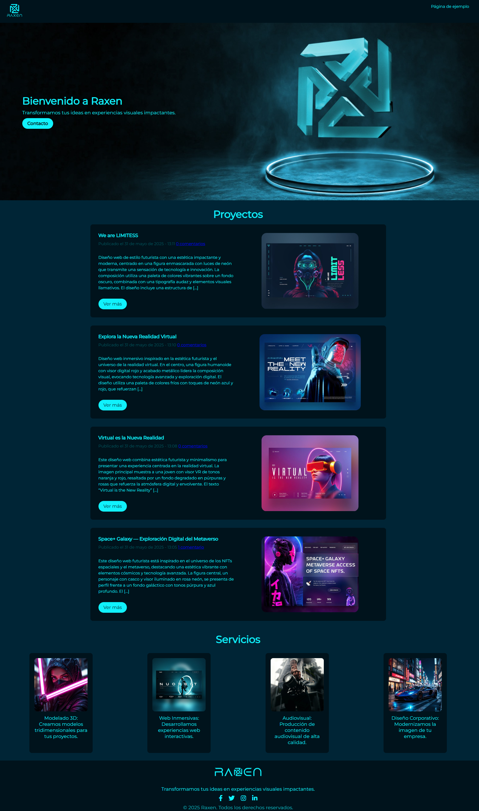
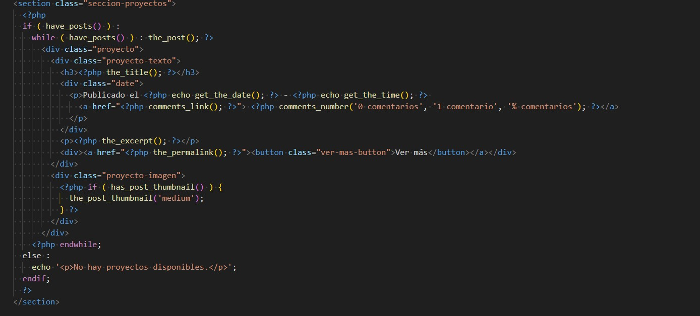

# 🎨 Raxen - Conversión de Web Estática a Tema WordPress

Este proyecto consiste en la conversión de una **web estática en HTML y CSS** a un **tema funcional de WordPress**, utilizando `PHP` y el sistema de plantillas de WordPress. El objetivo fue aprender a estructurar un tema, manejar loops dinámicos y probarlo en un entorno local con XAMPP.

---

## 🚀 Tecnologías utilizadas

- HTML5
- CSS3
- PHP
- WordPress
- XAMPP
- Duplicator

---

## 🛠️ Estructura del proyecto

1. **Maquetación Inicial**

   - Se creó una web estática utilizando HTML y CSS.
   - Se organizó la estructura del sitio con carpetas:
     ```
     /assets/img
     estilos.css
     index.html
     ```

2. **Conversión a Tema WordPress**

   - Se dividió el HTML en archivos de plantilla PHP:
     - `header.php`, `footer.php`, `index.php`, `front-page.php`, `single.php`, `page.php`, etc.
   - Se añadieron funciones nativas de WordPress:
     - `get_header()`, `get_footer()`, `the_loop`, `the_post_thumbnail()`, etc.

3. **Loop Dinámico en la Portada**

   - En la sección de **proyectos**, se implementó un loop de WordPress (`WP_Query`) para mostrar entradas dinámicas.
   - Cada proyecto se crea como una entrada en el administrador de WordPress.

4. **Entorno Local con XAMPP**

   - Se utilizó XAMPP para correr Apache y MySQL.
   - WordPress se instaló localmente para probar el tema.

5. **Entrega Final**
   - El tema fue empaquetado con Duplicator para generar un instalador completo.

---

## 📷 Capturas 

### Página de inicio

## 

### Loop de proyectos en la portada

## 
